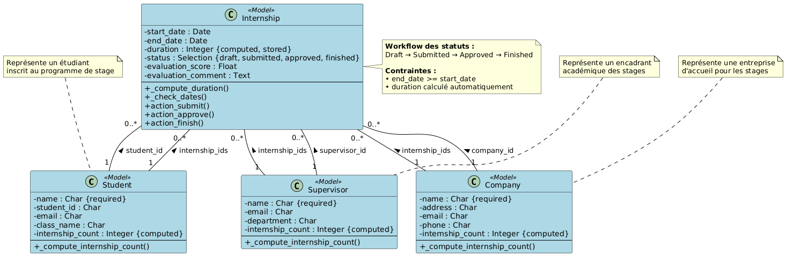

# Rapport de TP1 - Module Odoo 17
## Gestion des Stages Étudiants


---

## 1. Description du Module Réalisé

### 1.1 Objectif du Module

Le module **"Gestion des Stages Étudiants"** (student_internship) est un système complet de gestion des stages universitaires développé pour Odoo 17. Il permet aux établissements d'enseignement supérieur de gérer l'ensemble du cycle de vie des stages étudiants, depuis l'affectation jusqu'à l'évaluation finale.

### 1.2 Fonctionnalités Principales

Le module offre les fonctionnalités suivantes :

- **Gestion des étudiants** : Enregistrement et suivi des étudiants inscrits au programme de stage
- **Gestion des entreprises** : Base de données des entreprises partenaires offrant des opportunités de stage
- **Gestion des encadrants** : Suivi des superviseurs académiques responsables de l'encadrement
- **Gestion des stages** : 
  - Affectation des étudiants aux entreprises
  - Assignation des encadrants
  - Suivi des dates et calcul automatique de la durée
  - Workflow de validation en plusieurs étapes
  - Système d'évaluation avec notation et commentaires

### 1.3 Caractéristiques Techniques

- **Version Odoo** : 17.0
- **Dépendances** : Module `base` uniquement
- **Type** : Module applicatif autonome
- **Déploiement** : Docker avec PostgreSQL 15

---

## 2. Les Classes Utilisées

Le module est structuré autour de quatre modèles principaux interconnectés par des relations Many2one et One2many.

### 2.1 Diagramme de Classes



Pour générer le diagramme, utilisez le fichier `class_diagram.puml` avec PlantUML :
```bash
plantuml class_diagram.puml
```

### 2.2 Description Détaillée des Classes

#### 2.2.1 Classe `Student` (Étudiant)

**Modèle technique** : `student.internship.student`

**Attributs** :
- `name` (Char, obligatoire) : Nom complet de l'étudiant
- `student_id` (Char) : Numéro d'identification unique de l'étudiant
- `email` (Char) : Adresse email de l'étudiant
- `class_name` (Char) : Classe ou année d'études (ex: "3ème année", "Master 1")
- `internship_ids` (One2many → Internship) : Liste des stages associés
- `internship_count` (Integer, calculé) : Nombre total de stages

**Méthodes** :
- `_compute_internship_count()` : Calcule automatiquement le nombre de stages de l'étudiant

**Cardinalité** : Un étudiant peut avoir zéro ou plusieurs stages (1..*)

---

#### 2.2.2 Classe `Company` (Entreprise)

**Modèle technique** : `student.internship.company`

**Attributs** :
- `name` (Char, obligatoire) : Nom officiel de l'entreprise
- `address` (Char) : Adresse physique de l'entreprise
- `email` (Char) : Email de contact
- `phone` (Char) : Numéro de téléphone
- `internship_ids` (One2many → Internship) : Liste des stages proposés
- `internship_count` (Integer, calculé) : Nombre total de stages

**Méthodes** :
- `_compute_internship_count()` : Calcule le nombre de stages dans l'entreprise

**Cardinalité** : Une entreprise peut accueillir zéro ou plusieurs stagiaires (1..*)

---

#### 2.2.3 Classe `Supervisor` (Encadrant)

**Modèle technique** : `student.internship.supervisor`

**Attributs** :
- `name` (Char, obligatoire) : Nom complet de l'encadrant
- `email` (Char) : Adresse email professionnelle
- `department` (Char) : Département académique de rattachement
- `internship_ids` (One2many → Internship) : Liste des stages supervisés
- `internship_count` (Integer, calculé) : Nombre de stages supervisés

**Méthodes** :
- `_compute_internship_count()` : Calcule le nombre de stages encadrés

**Cardinalité** : Un superviseur peut encadrer zéro ou plusieurs stages (1..*)

---

#### 2.2.4 Classe `Internship` (Stage)

**Modèle technique** : `student.internship.internship`

**Attributs relationnels** :
- `student_id` (Many2one → Student, obligatoire) : Étudiant affecté au stage
- `company_id` (Many2one → Company, obligatoire) : Entreprise d'accueil
- `supervisor_id` (Many2one → Supervisor, obligatoire) : Encadrant académique

**Attributs de dates** :
- `start_date` (Date) : Date de début du stage
- `end_date` (Date) : Date de fin du stage
- `duration` (Integer, calculé, stocké) : Durée en jours

**Attributs de workflow** :
- `status` (Selection) : Statut du stage avec 4 valeurs possibles
  - `draft` : Brouillon (valeur par défaut)
  - `submitted` : Soumis
  - `approved` : Approuvé
  - `finished` : Terminé

**Attributs d'évaluation** :
- `evaluation_score` (Float) : Note d'évaluation (0-20)
- `evaluation_comment` (Text) : Commentaires détaillés de l'encadrant

**Méthodes** :
- `_compute_duration()` : Calcule automatiquement la durée en jours (end_date - start_date)
- `_check_dates()` : Contrainte de validation pour s'assurer que end_date >= start_date
- `action_submit()` : Transition de statut : draft → submitted
- `action_approve()` : Transition de statut : submitted → approved
- `action_finish()` : Transition de statut : approved → finished

**Cardinalité** : 
- Un stage appartient à exactement un étudiant (*.1)
- Un stage se déroule dans exactement une entreprise (*.1)
- Un stage est supervisé par exactement un encadrant (*.1)

---

## 3. Processus Métier du Module

### 3.1 Workflow Principal du Stage

Le module implémente un processus métier structuré en quatre phases distinctes :

```
┌─────────┐      ┌───────────┐      ┌──────────┐      ┌──────────┐
│ DRAFT   │─────▶│ SUBMITTED │─────▶│ APPROVED │─────▶│ FINISHED │
│ (Ébauche)│     │ (Soumis)  │      │ (Approuvé)│     │ (Terminé) │
└─────────┘      └───────────┘      └──────────┘      └──────────┘
   Initial         Étudiant          Superviseur        Superviseur
                   soumet            valide             clôture
```

#### Phase 1 : DRAFT (Brouillon)
- **Acteur** : Gestionnaire administratif / Étudiant
- **Actions** :
  - Création d'une nouvelle demande de stage
  - Saisie des informations de base (étudiant, entreprise, encadrant)
  - Définition des dates prévisionnelles
  - Vérification automatique : end_date >= start_date
  - Calcul automatique de la durée
- **Bouton disponible** : "Soumettre"

#### Phase 2 : SUBMITTED (Soumis)
- **Acteur** : Étudiant
- **Actions** :
  - L'étudiant finalise et soumet sa demande de stage
  - Le dossier est transmis au superviseur pour validation
  - Les données ne peuvent plus être modifiées librement
- **Bouton disponible** : "Approuver"

#### Phase 3 : APPROVED (Approuvé)
- **Acteur** : Superviseur académique
- **Actions** :
  - Le superviseur valide la demande de stage
  - Le stage est officiellement approuvé et peut commencer
  - Suivi pendant la durée du stage
  - Possibilité d'ajouter des notes intermédiaires
- **Bouton disponible** : "Terminer"

#### Phase 4 : FINISHED (Terminé)
- **Acteur** : Superviseur académique
- **Actions** :
  - Saisie de l'évaluation finale
  - Attribution d'une note (evaluation_score)
  - Rédaction des commentaires d'évaluation
  - Clôture définitive du stage
- **État final** : Archivage des données

### 3.2 Processus de Gestion des Entités

#### 3.2.1 Gestion des Étudiants
1. Création du profil étudiant avec informations personnelles
2. Affectation à une classe/promotion
3. Suivi historique de tous les stages effectués
4. Indicateur visuel du nombre de stages (internship_count)

#### 3.2.2 Gestion des Entreprises
1. Enregistrement des entreprises partenaires
2. Stockage des coordonnées complètes (adresse, email, téléphone)
3. Suivi du nombre de stagiaires accueillis
4. Historique complet des stages proposés

#### 3.2.3 Gestion des Superviseurs
1. Création des profils des encadrants académiques
2. Affectation par département
3. Suivi de la charge d'encadrement (nombre de stages supervisés)
4. Vue consolidée des stages en cours et terminés

### 3.3 Règles de Gestion Implémentées

#### Contraintes de Validation
- **Dates cohérentes** : La date de fin ne peut pas être antérieure à la date de début
- **Champs obligatoires** : Un stage doit obligatoirement avoir un étudiant, une entreprise et un superviseur
- **Intégrité relationnelle** : Impossible de supprimer une entité si elle est référencée dans des stages actifs

#### Calculs Automatiques
- **Durée du stage** : Calculée automatiquement en jours lors de la saisie des dates
- **Compteurs** : Tous les compteurs (internship_count) sont mis à jour en temps réel

#### Workflow de Statut
- **Séquence stricte** : Les transitions de statut suivent un ordre défini (pas de retour arrière)
- **Boutons contextuels** : Seul le bouton correspondant à l'action suivante est visible
- **Barre de statut visuelle** : Widget statusbar montrant la progression dans le workflow

### 3.4 Interface Utilisateur

#### Vues Disponibles
- **Vue Liste** : Pour chaque entité, affichage tabulaire avec les informations essentielles
- **Vue Formulaire** : Formulaires détaillés avec organisation en sections logiques
- **Widget Notebook** : Onglets pour visualiser les relations (ex: stages d'un étudiant)
- **Barre de statut** : Affichage visuel du workflow sur le formulaire stage

#### Navigation
Organisation hiérarchique dans le menu principal "Gestion des Stages" :
```
Gestion des Stages
├── Étudiants
├── Entreprises
├── Encadrants
└── Stages
```

---

## 4. Architecture Technique

### 4.1 Structure des Fichiers

```
student_internship/
├── __manifest__.py          # Déclaration du module
├── __init__.py              # Import du package models
├── models/
│   ├── __init__.py          # Import des modèles
│   ├── student.py           # Modèle Étudiant
│   ├── company.py           # Modèle Entreprise
│   ├── supervisor.py        # Modèle Encadrant
│   └── internship.py        # Modèle Stage
├── views/
│   ├── student_views.xml    # Vues Étudiant
│   ├── company_views.xml    # Vues Entreprise
│   ├── supervisor_views.xml # Vues Encadrant
│   ├── internship_views.xml # Vues Stage
│   └── menu.xml             # Structure de navigation
└── security/
    └── ir.model.access.csv  # Droits d'accès
```

### 4.2 Déploiement

Le module est déployé via Docker Compose avec :
- **PostgreSQL 15** : Base de données
- **Odoo 17** : Serveur applicatif
- **Volume personnalisé** : Montage du module dans `/mnt/extra-addons/`

### 4.3 Sécurité

- **Groupe d'accès** : `base.group_user` (utilisateurs internes)
- **Permissions** : Lecture, Écriture, Création, Suppression pour tous les modèles
- **Extensibilité** : Structure préparée pour l'ajout de rôles spécifiques (étudiant, superviseur, admin)

---

## 5. Conclusion

Le module **student_internship** offre une solution complète et professionnelle pour la gestion des stages universitaires dans Odoo 17. Son architecture modulaire, son workflow structuré et ses calculs automatiques en font un outil efficace pour les établissements d'enseignement supérieur.

### Points Forts
✓ Architecture claire et maintenable  
✓ Workflow métier complet avec validation  
✓ Calculs automatiques (durée, compteurs)  
✓ Contraintes de validation robustes  
✓ Interface utilisateur intuitive  
✓ Code documenté et conforme aux standards Odoo 17  

### Perspectives d'Évolution
- Ajout de rapports PDF automatiques
- Système de notifications par email
- Gestion de documents (convention de stage, attestations)
- Dashboard avec statistiques et graphiques
- Gestion des droits d'accès par rôle (étudiant/superviseur/admin)
- Export de données pour analyses

---

**Fin du Rapport**
